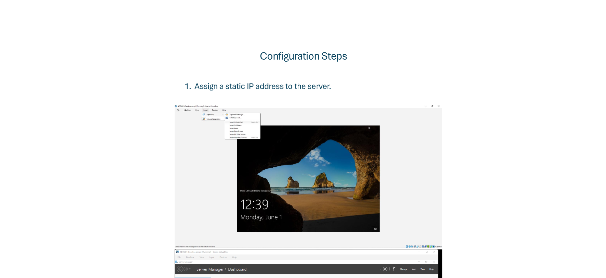

## Configure Active Directory environment supporting simulated employee onboarding. 

### Objective

Deploy and Configure an Active Directory Environment 
Goal: Create a centralized Active Directory environment for managing users and resources.
 
### Tools Used

VirtualBox, Microsoft Server 2022, Windows 11 ISO

### Steps

1. Install Windows Server in a virtual machine (e.g., Hyper-V or VirtualBox).
2. Assign a static IP address to the server.
3. Install the Active Directory Domain Services (AD DS) role.
4. Promote the server to a Domain Controller.
5. Create a new Active Directory domain (e.g., EstCyber.com).
6. Verify DNS configuration and domain functionality.
7. RAS and DHCP configuration
8. Join client machines to the domain.

### Click Screenshot below for manual

