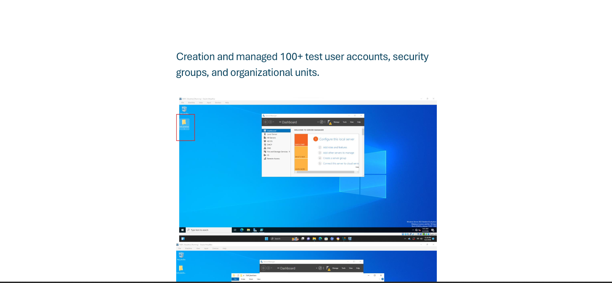

## Creation and managment of 100+ test user accounts, security groups, and organizational units.. 

### Objective

Create and Manage 100+ Test User Accounts 
Design and Implement an Organizational Unit (OU) Structure  
Goal: Create a real-world workforce by provisioning and managing user accounts, creating a logical Active Directory hierarchy that reflects the organization's departments and simplifies administration.

 
### Steps

1. Defined a standardized naming convention for user accounts (e.g., first initial + last name).
2. Created 100+ Active Directory user accounts representing employees from departments such as HR, IT, Finance, Sales, and Marketing.
3. Configured user attributes, including full name, job title, department, email address, office location, and manager.
4. Assigned temporary passwords and enabled the "User must change password at next logon" setting.
5. Verified successful authentication by testing user logins from domain-joined client machines.
6. Updated user information and managed account lifecycle activities to reflect promotions, department transfers, and employee departures.
7. Analyzed the organization's departmental structure and administrative requirements.
8. Created a top-level Organizational Unit (OU) for the company.
9. Created departmental OUs for HR, IT, Finance, Sales, Marketing, and Operations.
10. Organized user accounts, computer accounts, and service accounts into their respective OUs.
11. Created security groups for each department to support role-based access control (RBAC).

### Click Screenshot below for manual

