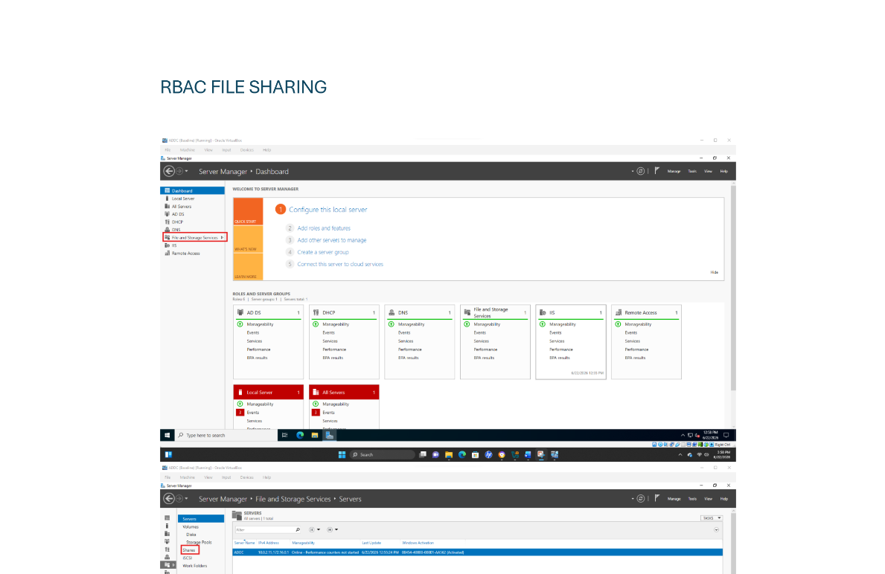

## 1.Implement Role-Based Access Controls (RBAC) for Shared Folder Mapped Drives.

### Objective

Provide users with access to shared drives based on their deparment and job role while ensuring least-privilege access.

 
### Steps

1. Create Shared Folders.
2. Configure NTFS Permissions.
3. Create Drive Mapping GPO.
4. Configure Mapped Drives.
5. Apply GPO.
6. Verify Access.

## 2.Deploy Software Using GPO.

### Objective

Automate software installation and operating system deployment for computers within designated Organizational Units.

 
### Steps

1. Create or use an existen shared folder for software storage.
2. Download MSI installation package to the share.
3. Create software deployment GPO.
4. Configure software installation.
5. Link GPO to computer OU.
6. Apply and check.

## 3.Configure Password Complexity and Account Lockout Policies.

### Objective

Protect user accounts by enforcing strong authentication requirements and preventing brute-force attacks.

 
### Steps

1. Open group policy management.
2. Edit default domain policy.
3. Configure password policy.
4. Configure account lockout policy.
5. Apply policies.
6. Verify Configuration.

### Click Screenshot below for manual

