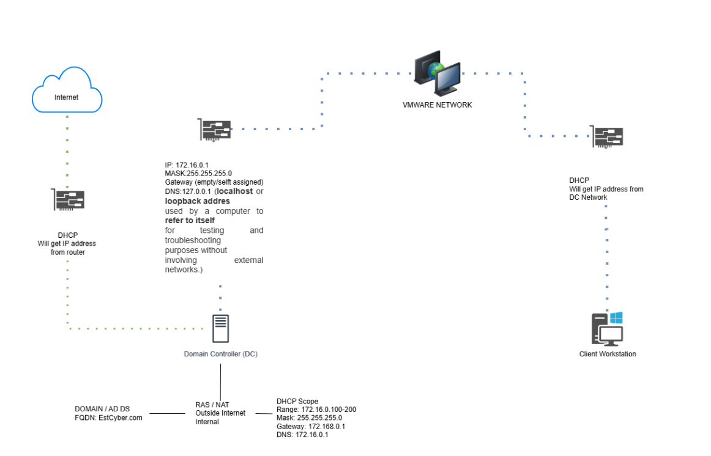

# Enterprise Identity Management Lab
Environment: Windows Server 2022, Active Directory Domain Services (AD DS), Group Policy Management (GPMC), Windows 11, VBox
### Objective 
Designed and administered a simulated enterprise Active Directory environment to develop hands-on experience with identity and access management (IAM), Group Policy administration, endpoint management, and security hardening. Successfully managed over 100 user accounts and implemented role-based access controls, automated software deployment, and domain security policies to replicate real-world IT operations and user lifecycle management processes.

### Key Accomplishments

1. Built and maintained a Windows Server 2022 Active Directory domain supporting 100+ user accounts, security groups, and Organizational Units (OUs) in a virtualized VBox environment.
2. Simulated enterprise user lifecycle management processes, including employee onboarding, departmental transfers, and offboarding workflows.
3. Implemented Role-Based Access Control (RBAC) using Active Directory security groups to enforce least-privilege access and segregate departmental resources.
4. Designed and managed Organizational Units (OUs) to mirror enterprise departmental structures and support delegated administration.
5. Configured and deployed Group Policy Objects (GPOs) to standardize security settings, user configurations, and workstation management across the domain.
6. Automated software deployment through Group Policy Software Installation, reducing manual installation requirements and ensuring consistent application delivery.
7. Enforced enterprise security controls by configuring password complexity requirements, password history, password expiration, and account lockout policies through GPOs.
8. Performed validation testing to verify policy application, user permissions, drive mappings, and software deployment across Windows 11 client systems.
9. Developed practical experience with Active Directory, Group Policy Management, Windows Server Administration, Identity and Access Management (IAM), RBAC, Software Deployment, and Security Compliance.    

